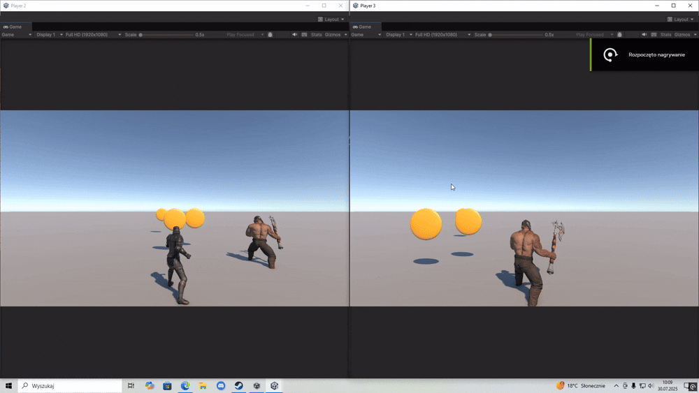
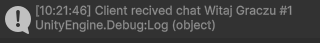

# Basic DOTS Multiplayer
Projekt oparty na wersji Unity `6000.0.51f1`, z wykorzystaniem URP i dedykowanego serwera.

## Funkcjonalności

### Synchronizacja graczy
- Dwóch graczy może poruszać się po wspólnej scenie (Plane)
- Każdy gracz otrzymuje inny model (`A` lub `B`)
- Synchronizowane dane: ruch, pozycja, wejście (input)
- Wykorzystano: `GhostAuthoringComponent`, `NetworkTransform`, `InputComponent`, `PlayerTag`

### Lokalna obsługa animacji
- Animacje uruchamiane lokalnie na podstawie wejścia (np. ruch do przodu)
- Brak synchronizacji animacji przez sieć (ograniczenie DOTS, brak wsparcia dla animatora)

### Zbieranie monet
- Gracze mogą podnosić monety
- Serwer zarządza ich usuwaniem i rozsyła aktualizację do klientów
- Wykorzystano: Ghost prefab + `EntityCommandBuffer`

### RPC – wiadomość powitalna
- Po dołączeniu gracza serwer wysyła do niego powitalny komunikat
- Zrealizowane z pomocą `IRpcCommand` i `EntityCommandBuffer`

---

## Ograniczenia

### Synchronizacja animacji
- Unity DOTS nie wspiera bezpośrednio klasycznego komponentu `Animator`.  
- Z tego powodu nie udało się zsynchronizować stanów animacji między klientami.  
---

## Materiały wizualne

| Gif prezentujący działanie | Wiadomość od serwera (Debug.Log) |
|----------------------------|----------------------------------|
|  |   |

